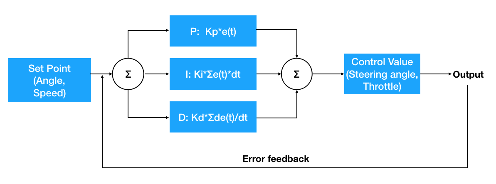
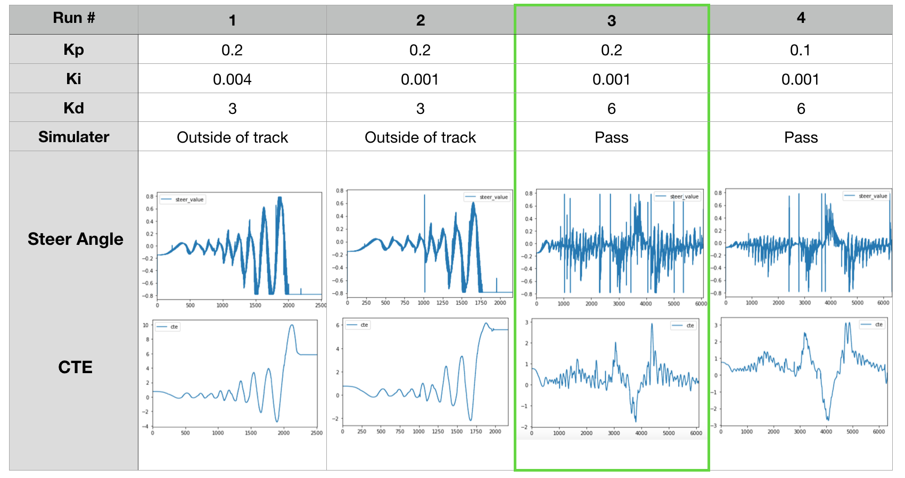

# PID Contol project
Self-Driving Car Engineer Nanodegree Program
   

## The project
To drive a car around the lake track with a PID controller in C++. The PID conroller will use the cross track error (CTE) and the velocity (mph) to compute appropriate steering angle and driving speed. The speed limit is 100mph.

The project starter code can be found [here](https://github.com/udacity/CarND-PID-Control-Project) 
The simulator can be downloaded [here](https://github.com/udacity/self-driving-car-sim/releases)

## Result
A video is genrated. Please click the below image for a linked youtube video.
<a href="http://www.youtube.com/watch?v=tUYXG7Axgyg
" target="_blank"></a>

## Reflection

### PID components

* "P" stands for propotional. The control value is propotional to the CTE.  The control value/ steering angle to overcome the error is written as `-Kp * CTE ` where Kp is the gain constant .

* "I" stands for integration. It is obtained by summing CTE from t=0. It elimiates the residule error from historic accumatlation.  The control contribution is `- Ki * sum(CTE*dt)` where Ki is the gain constant.

* "D" stands for differential. It is the CTE changing rate. It gives a larger damping effect with more rapid error change. The cotrol value is `- Kd * (dCTE/dt)`is Kd where the gain constant.

* For the steering PID controller, CTE is the angle difference between the track and car trajectory. The control value is steering angle (`steer_value`). 

* For the speed PID controller, the difference between car current speed and target speed is used as error feedback `cte_speed`. The contral value is `throttle`. T In order to make sure car doesn't run out of the track, the car is reduced while making turns. The target speed is caluated as `speed_target = 90. * (1. - 0.1*abs(steer_value)) + 10.` 



### PID gain (Kp, Ki, Kd) tuning
* Manual tuning is used to find the Kp, Ki, and Kd as below. The final pramaters is circled in green. The same parameters are also used for both steering angle PID and speed/throttle PID controllers.
	- Run #1: The values used in the class (Kp, Ki, Kd) = (0.2, 0.004, 3) is used as my starting point. The oscillation is large and the amplitude grows with time. The car crashes on the side.
	- Run #2: To reduce the oscillation amplitude, the integration term gain Ki is decreased because integration accumulates error. The car still crashes on the side.
	- Run #3: To make the CTE amplitude stable over time, Kd is increased to make the error chagne rate to work as a damping factor. The car passes the track for one round.
	- Run #4: Kp is decreased for smaller steering angle adjustment. It helps to minimize sharp turns. However, too much reduction results in insuffcient angle adjustment which make the car run outside of track. Run #4 shows a reduction in Kp to 2. The car drives around the track successfully. But CTE is larger the Run3 overall. 




## Build and Execution

1. Clone this repo.
2. Make a build directory: `mkdir build && cd build`
3. Compile: `cmake .. && make`
4. Run it: `./pid`.
5. Open [simulator](https://github.com/udacity/self-driving-car-sim/releases). Choose resolution, and click Next until "PID COntroller". Click "Select". 


## Dependencies

* cmake >= 3.5
  * All OSes: [click here for installation instructions](https://cmake.org/install/)
* make >= 4.1
  * Linux: make is installed by default on most Linux distros
  * Mac: [install Xcode command line tools to get make](https://developer.apple.com/xcode/features/)
  * Windows: [Click here for installation instructions](http://gnuwin32.sourceforge.net/packages/make.htm)
* gcc/g++ >= 5.4
  * Linux: gcc / g++ is installed by default on most Linux distros
  * Mac: same deal as make - [install Xcode command line tools]((https://developer.apple.com/xcode/features/)
  * Windows: recommend using [MinGW](http://www.mingw.org/)
* [uWebSockets](https://github.com/uWebSockets/uWebSockets)
  * Run either `install-mac.sh` or `install-ubuntu.sh`.
  * If you install from source, checkout to commit `e94b6e1`, i.e.
    ```
    git clone https://github.com/uWebSockets/uWebSockets 
    cd uWebSockets
    git checkout e94b6e1
